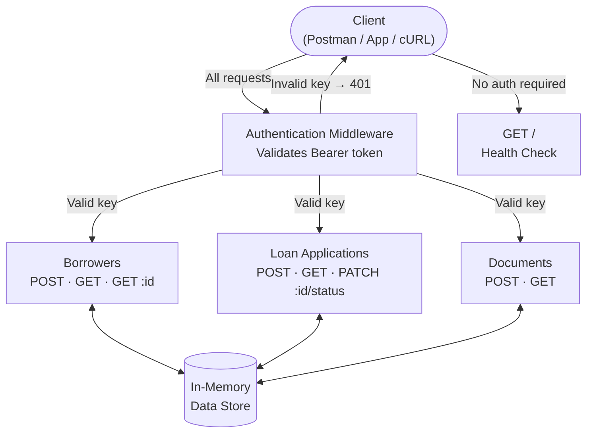
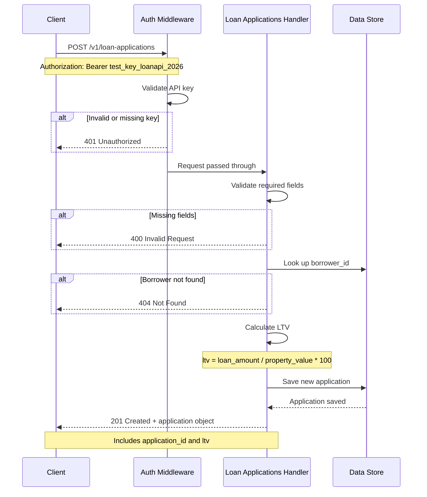
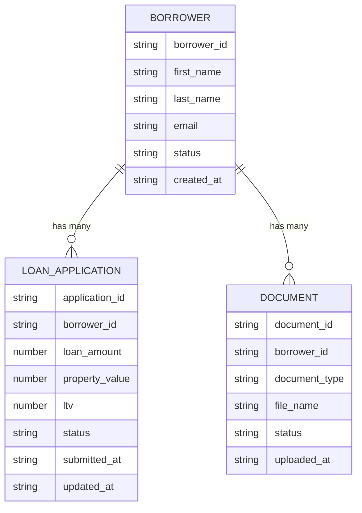
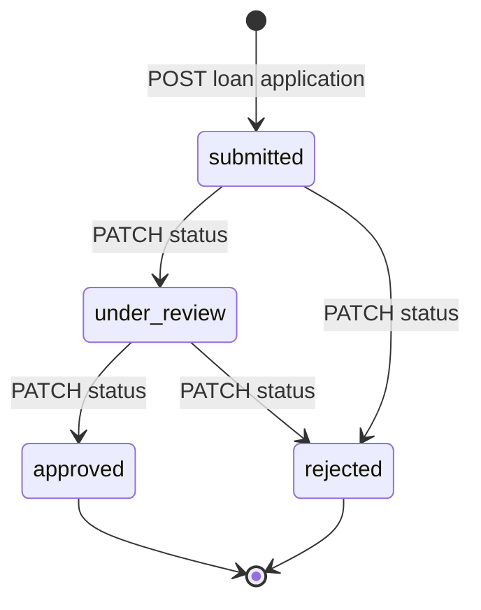

# Architecture

## API Architecture

The Loan Processing API follows a standard REST architecture. All requests flow through authentication middleware before reaching the endpoint handlers.

## Request Sequence — Submit Loan Application

This diagram shows exactly what happens inside the API when a developer
sends a `POST /v1/loan-applications` request.

---

## Data Relationships

---

## Loan Status Workflow

---

## Related

- [Endpoints — Borrowers](endpoints/borrowers.md)
- [Endpoints — Loan Applications](endpoints/loan-applications.md)
- [Endpoints — Documents](endpoints/documents.md)
- [Versioning](versioning.md)